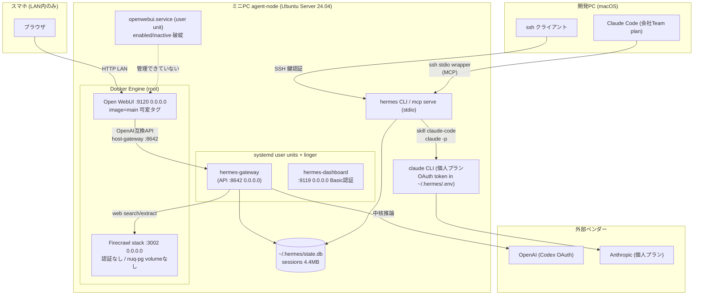

# 02. 現状評価とギャップ

- 最終更新: 2026-07-20
- 上位文書: [README.md](README.md)

## 1. 検証方法と限界

本設計セッションは **開発PC上** で実行されており、対象ミニPCへのライブ接続は行っていない。
したがって本章のミニPC状態はすべて次の2文書に記録された **2026-07-20時点のスナップショット** である。

- [pda_minipc_setup_record.md](../../pda_minipc_setup_record.md)（更新日 2026-07-20。以下REC）
- [.hermes/plans/2026-07-20_202237-pda-current-state-and-next-roadmap.md](../../.hermes/plans/2026-07-20_202237-pda-current-state-and-next-roadmap.md)（同日、ミニPC上でのライブ確認を含む。以下HYP）

それ以降に変化し得る事項（バージョン、サービス状態、ポート、DBサイズ等）は
**Unverified/Stale Candidate** として扱う。M0着手時に `pda doctor` 相当の
read-only確認で再検証する（[09](09-transition-roadmap.md)）。

外部仕様は本セッションで公式一次資料を確認した（確認日 2026-07-20）。
参照は本文書§6にまとめる。

## 2. 検証済み現状（Fact）

### 2.1 リポジトリ

- Fact（本セッションで直接確認）: 追跡ファイルは `personal_delegate_agent_plan.md`、
  `pda_minipc_setup_record.md`、`.hermes/plans/`・`.hermes/prompts/` 配下の2件のみ。
  実装コード・テスト・schema・IaC・復旧手順は存在しない
- 帰結: このリポジトリは現時点で「PDA本体」ではなく構想書と運用記録である。
  実体は ミニPC上の `~/.hermes/`、`~/firecrawl/`、`~/openwebui/`、systemd user units、
  Docker volumesに分散し、再構築可能な形で管理されていない（HYP §1.1と一致）

### 2.2 ミニPC構成（2026-07-20スナップショット）

| 項目 | 状態 | 出典 |
|------|------|------|
| ハードウェア | GMKtec M8（Ryzen 5 PRO 6650H / 16GB LPDDR5 / 512GB SSD）。実効RAM 12GiB・空き約7GiB、SSD空き約396GiB | REC§2, HYP§1.2 |
| OS | Ubuntu Server 24.04.4 LTS。SSH鍵認証で開発PCから管理 | REC§5 |
| Hermes | v0.18.2。中核推論 = OpenAI Codex OAuth（`gpt-5.6-sol`）。local terminal backend | HYP§1.2, REC§5.7 |
| Hermesセッション | state.db 19 sessions / 132 messages / 4.4MB（当時） | HYP§1.2 |
| Hermes Gateway / Dashboard | systemd user unit＋linger で常駐。Dashboard `:9119`（Basic認証） | REC§5.13-5.14 |
| Hermes API | OpenAI互換 `:8642`（Bearer key）。`/v1/chat/completions` 等 | REC§5.17 |
| Open WebUI | 主UI。Docker（`ghcr.io/open-webui/open-webui:main` 可変タグ）`:9120` | REC§5.17 |
| Firecrawl | self-hosted。Docker compose 7コンテナ級、`:3002`、**認証なし** | REC§5.8, HYP§1.3 |
| Claude Code（ミニPC） | v2.1.205。個人プランの長期OAuthトークン（`~/.hermes/.env`、1年有効） | REC§5.18 |
| Claude Code（開発PC） | 会社Team plan。`ssh agent-node ... hermes mcp serve` でHermes MCPへ片方向接続 | REC§5.16 |
| Hermes→Claude Code | バンドルスキル `claude-code` 経由 `claude -p` 実行で逆方向連携済み | REC§5.18 |
| 未導入 | Tailscale、restic/borg/rclone、PDA実装、PKB | HYP§1.2, REC§7 |
| Hermes cron / MCP client設定 | 0件 | HYP§1.2 |
| built-in memory | 有効だが `MEMORY.md`/`USER.md` 未作成 | HYP§1.2 |

### 2.3 運用上の欠陥（HYPがライブ確認、2026-07-20）

| # | 欠陥 | 影響 |
|---|------|------|
| G-1 | `openwebui.service`（user unit）がenabledだがinactive。`Requires=docker.service` がuser manager上not-found。実体はDockerの `restart: unless-stopped` で稼働 → **二重・分裂管理** | reboot後の自動復旧が未保証。REC§8の「すべて自動起動」と矛盾（§3 矛盾C-2） |
| G-2 | 実行ユーザーがdocker group非所属でsocketアクセス不可 | user unitからのcompose操作は構造的に失敗する |
| G-3 | Open WebUI imageが可変タグ`main` | 再構築時の同一性を保証できない |
| G-4 | Firecrawl `nuq-postgres` に永続volumeなし | コンテナ削除でデータ消失 |
| G-5 | `:3002 / :8642 / :9119 / :9120` が `0.0.0.0` 待受。Firecrawlは認証なし | LAN内の任意端末から到達可能。Firecrawlは無認証で利用・悪用可能 |
| G-6 | fresh-host復元・再起動後health・オフホストバックアップが未実証 | ミニPC喪失＝PDA関連状態の全損リスク |
| G-7 | secretの平文集中（`~/.hermes/.env` にAPI key・OAuth token等） | ファイル権限600のみが防御。バックアップ設計時に漏洩経路になり得る |

いずれも **Unverified/Stale Candidate**（2026-07-20以降に修正された可能性はあるが記録がない）。

## 3. 資料間の矛盾一覧と裁定

黙って平均化せず、採用判断を明記する。

| # | 矛盾 | 裁定 |
|---|------|------|
| C-1 | REC§8「フェーズ1〜3達成」 vs HYP§2「Phase 1運用品質は再オープン、2部分、3はPoCのみ」 | **HYPを採用**。到達の粒度を「機能PoC完了／運用完了／評価完了」に分ける（[08 §2](08-evaluation-and-phase-gates.md)）。RECの表現は「通信経路のPoC完了」としては正しい |
| C-2 | REC§8「すべてsystemd/Docker restartで再起動後も自動起動」 vs HYP G-1/G-2（openwebui user unit破綻、reboot未実証） | **HYPを採用**（同日中の後発ライブ確認）。reboot healthはM0の実測対象 |
| C-3 | REC§5.17がOpen WebUIの「systemd＋Docker二重管理」を構成として記載 vs HYPは欠陥と判定 | **欠陥と裁定**。single-owner原則（[ADR-0006](../adr/0006-service-management-single-owner.md)）で解消 |
| C-4 | PLAN§6.6「すべての入出力を記録」「過去一年以上の履歴取込」 vs HYP gate「無条件保存しない」・brief命題12（最小化） | **最小化優先で要求を修正**。R-07は「除外規則・retention付きの広範な記録」と再定義。過去履歴の一括取込は connectorごとの安全性実証後（[09](09-transition-roadmap.md) M2） |
| C-5 | PLAN P8-11の語彙（多層認知ゲート等）が「Phase 8まで統制なし」と読める vs briefは決定論的ゲートの前倒しを要求 | **決定論的ゲートをM0〜M1へ前倒し**（[06 §6](06-security-privacy-and-governance.md)）。認知ゲートはM5のまま |
| C-6 | REC§6.1「Basic認証＋LAN内公開で可」 vs HYP「LAN内だから安全という誤認」 | **HYPを採用**。ネットワーク階層はloopback/内部network → VPN → LAN例外の順で設計（[07 §4](07-deployment-operations-and-recovery.md)） |
| C-7 | HYP Task 1が `pda_minipc_setup_record.md` の修正を指示 vs brief作業制約「史料は上書きしない」 | **本設計では史料を修正しない**。差分提案は本表C-1〜C-2が担う。将来RECを更新する場合も追記型とする |
| C-8 | HYPの性能・品質metric数値（Recall@5≥0.85等）が確定値のように読める | **初期仮説へ格下げ**。測定方法・再調整条件付きで [08 §4](08-evaluation-and-phase-gates.md) に再掲 |
| C-9 | 開発PC Claude Code（会社アカウント）がHermes（個人環境）のMCPへ接続済み（REC§5.16） vs アカウント・データ境界の厳格分離方針（REC§5.18） | **境界問題として顕在化**。個人domainのcontextを会社アカウントruntimeへ提供する条件はOQ-5として未決。当面のE2EはミニPC内の個人Claude Codeで実施（[05 §6](05-orchestration-and-runtime-contracts.md)） |

## 4. 現行deployment topology（図1）

2026-07-20時点の記録に基づく。破線は未導入・未実証。

構成上の含意:

- **正本らしきものがすべてruntime/UI固有ストアにある**（state.db、Open WebUI DB、`.env`）。INV-1違反状態
- **Hermesが単一障害点**: 対話UI（Open WebUI経由含む）・オーケストレーション・履歴保持・逆方向委任がすべてHermes経由
- **個人会話の全量がOpenAIへegressしている**（Hermes中核=Codex）。egress policy未確定（OQ-3）
- **PDA構成要素（Context Spine等）はまだ存在しない**

## 5. 現在フェーズの再判定（Decision）

構想のPhase 1〜11に対する判定。粒度は「機能PoC／運用完了／評価完了」
（[08 §2](08-evaluation-and-phase-gates.md) で定義）。

| Phase | 判定 | 根拠 |
|-------|------|------|
| P1 常時稼働基盤 | 機能PoC: **完了** / 運用: **未完了** / 評価: 未 | 稼働は成立。再現構成・backup・restore・reboot health・network境界が欠落（G-1〜G-7） |
| P2 Hermes最小PDA | 機能PoC: **概ね完了** / 運用: 未 / 評価: 未 | 対話・ツール実行・セッション保存は成立。セッション間記憶の実用・cron・承認区別は未実証 |
| P3 複数runtime統合 | 機能PoC: **通信経路のみ完了** / 運用: 未 / 評価: 未 | 双方向連携PoCは成立。共通タスクコンテキスト・切替継続・並列・自動選択は未着手 |
| P4 情報取り込み | **未着手**（Firecrawl・state.db等の準備資産のみ） | — |
| P5 PKB/コンテキストグラフ | **未着手** | session_search（FTS5）とbuilt-in memoryはPKBの代替にならない |
| P6〜P11 | **未着手** | — |

**現在地の正式判定**: 「Phase 3の通信PoC完了後、Phase 4進入前」。HYPの呼称
「Phase 3.5（運用安定化・情報境界・Context Spine設計）」を **採用** する。
ただし本設計では以後、実行単位をマイルストーンM0〜M6で管理し（[09](09-transition-roadmap.md)）、
Phase 1〜11は能力マップとして保持する（両者の写像は [09 §6](09-transition-roadmap.md)）。

## 6. 本設計が依拠する外部仕様（一次資料、確認日 2026-07-20）

| 事項 | 確認内容 | 出典 |
|------|----------|------|
| SQLite FTS5 trigram | 3文字未満の部分文字列はFTSクエリ非マッチ。`case_sensitive`/`remove_diacritics`オプション。trigram表はLIKE/GLOBの索引最適化に対応（case_sensitive=1時はGLOBのみ） | <https://sqlite.org/fts5.html> |
| SQLite Online Backup API | 稼働中DBの整合スナップショットを増分取得可能。代替として `VACUUM INTO` | <https://sqlite.org/backup.html> |
| Ubuntu 24.04のSQLite | sqlite3 3.45.1（trigram要件3.34+を満たす） | <https://packages.ubuntu.com/noble/sqlite3> |
| MCP仕様（rev 2025-11-25） | transportは **stdio** と **Streamable HTTP** の2種。Streamable HTTPはOrigin検証MUST・localhost bind SHOULD・認証SHOULD | <https://modelcontextprotocol.io/specification/2025-11-25/basic/transports> |
| Claude Code | MCP client（stdio等）を `claude mcp add` で登録可能 | <https://code.claude.com/docs/en/mcp> |
| Codex CLI | MCP client対応（`codex mcp add`、`~/.codex/config.toml`）。非対話モードあり。ChatGPTプランOAuthまたはAPIキー | <https://developers.openai.com/codex/mcp> |
| Hermes Agent | MIT license。MCP client＋`hermes mcp serve`。messaging gateway（Telegram/Discord/Slack/WhatsApp/Signal/CLI）。skills（agentskills.io互換） | <https://github.com/NousResearch/hermes-agent> |
| Open WebUI | self-hosted UI。OpenAI互換APIバックエンド・Docker配備・内蔵認証 | <https://github.com/open-webui/open-webui> |
| Firecrawl self-host | APIキー認証はデフォルト無効（DB認証はSupabase前提）。`/search` はGoogle既定・SearXNG併用可 | <https://docs.firecrawl.dev/contributing/self-host> |
| Tailscale ACL | tailnet policy file（huJSON）。新規tailnetは既定allow-all。per-user/per-portの制限が可能 | <https://tailscale.com/kb/1018/acls> |
| restic | 暗号化リポジトリ。local/SFTP/S3/B2/Azure/GCS/rclone等のバックエンド | <https://restic.readthedocs.io/en/stable/030_preparing_a_new_repo.html> |

注: `hermes mcp serve` がstdio専用でHTTPリスナー・認証を持たない、`hermes sessions export --format jsonl`
が存在する等のHermes詳細仕様は、REC/HYPの実機確認記録に依拠する（**Unverified/Stale Candidate**。
Hermesはバージョン更新が速く、M1実装時に再確認する）。

## 7. ギャップとリスク

| # | ギャップ / リスク | 対応（設計上の受け皿） |
|---|-------------------|------------------------|
| GAP-1 | 正本の不在: PDAとしての継続性を担うデータ層が存在しない | Context Spine（[04](04-context-spine-and-data-contracts.md)、[ADR-0001](../adr/0001-canonical-store-sqlite-append-only-ledger.md)） |
| GAP-2 | 復元不能: backup・restore・IaCが未整備のまま状態が蓄積している | M0 restore-first（INV-7、[07](07-deployment-operations-and-recovery.md)） |
| GAP-3 | ネットワーク境界の欠如（G-5） | [07 §4](07-deployment-operations-and-recovery.md) の階層化、Tailscale判断はOQ-2 |
| GAP-4 | egress無統制: 個人会話全量がOpenAIへ流れる構造の明示的な追認がない | egress policy（[06 §5](06-security-privacy-and-governance.md)、OQ-3） |
| GAP-5 | Hermes単一障害点＋外部ベンダー依存の連鎖（Hermes→OpenAI） | degraded mode設計（[07 §7](07-deployment-operations-and-recovery.md)）、runtime交換（M6） |
| GAP-6 | 会社アカウントruntimeと個人環境の接点（C-9） | OQ-5、egress policyのprincipal区分（[06 §5](06-security-privacy-and-governance.md)） |
| GAP-7 | 評価不在: 進歩を測るgold set・baselineがない | [08](08-evaluation-and-phase-gates.md) |
| GAP-8 | 運用が個人の記憶に依存（手順が2文書の散文のみ） | IaC化・runbook化（M0、[07](07-deployment-operations-and-recovery.md)） |
| GAP-9 | ディスク暗号化の記録なし（LUKS採否不明 → おそらく未使用） | OQ-8。当面はbackup暗号化と物理管理で緩和 |
| GAP-10 | Claude Code長期OAuthトークン（1年）等のsecret更新運用が未定義 | secret inventoryと更新カレンダー（[07 §5](07-deployment-operations-and-recovery.md)） |

## 8. 移行制約

1. **稼働継続**: 移行作業中もHermes・Open WebUIの日常利用を止めない（利用者=運用者の生活導線）
2. **史料保全**: 既存2文書とHYPは削除・改変しない（brief作業制約4）
3. **データ持ち出し禁止**: 移行・検証作業でsecret・個人データ本文をrepoへ含めない
4. **段階的privilege分離**: 現状は単一ユーザー内で全プロセスが動く。M1は同一ユーザーで成立させ、M3で分離（[03 §5](03-target-architecture.md)）。最初から分離を要求すると価値実証が遅れる
5. **ミニPC性能**: 同時に走らせられるworkloadに上限がある。ingest・index再構築はバッチ／夜間で設計（[07 §8](07-deployment-operations-and-recovery.md)）
6. **アカウント分離**: 会社Team plan資産（開発PC）と個人プラン資産（ミニPC）の認証情報を相互に移動しない（REC§5.18の設計原則を維持）
