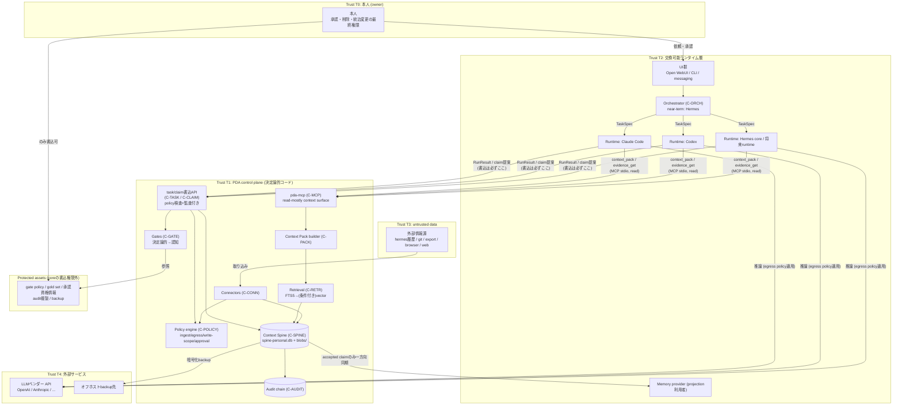
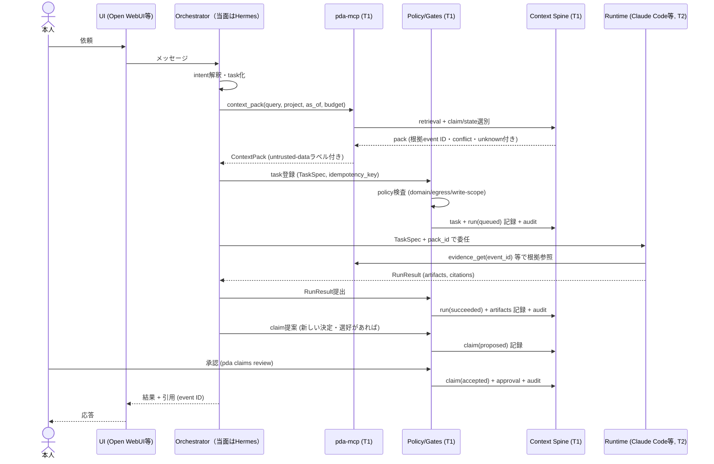

# 03. 目標アーキテクチャ

- 最終更新: 2026-07-20
- 上位文書: [README.md](README.md)
- 関連: データ契約は [04](04-context-spine-and-data-contracts.md)、実行契約は [05](05-orchestration-and-runtime-contracts.md)、統治は [06](06-security-privacy-and-governance.md)、配備・運用は [07](07-deployment-operations-and-recovery.md)

## 1. 設計方針の要約

1. **正本と統治を交換対象の外へ**（INV-1, INV-8）: Context Spine・policy・監査・評価資産がPDAの同一性を担い、runtime／orchestrator／UI／memory providerは交換部品とする
2. **ledger-first**: 観測はすべて追記専用のCanonicalEventとして入る。運用状態（claim/task/run）はeventと同一トランザクションで更新し、projectionはいつでも再生成できる（[ADR-0001](../adr/0001-canonical-store-sqlite-append-only-ledger.md)）
3. **決定論的な統制を先に、認知的な統制を後に**: policy engine・権限・監査・承認（M0〜M3）が土台。LLMによる認知ゲートはM5で追加する（[06](06-security-privacy-and-governance.md)）
4. **単一ホスト・一人運用で成立する複雑性に限定**（NG-3）: デーモンはSpineアクセス仲介の1つ（transition以降）まで。ブローカー・分散DBは導入しない
5. **near-term / transition / target を分離**: 現行ミニPCで成立する形から、権限分離を経て、コア交換可能な最終形へ段階移行する（§5）

## 2. 最終論理アーキテクチャと信頼境界（図2）

**信頼レベル定義**:

| Level | 主体 | 信頼の内容 |
|-------|------|-----------|
| T0 | 本人 | 最終権限。承認・削除・統治変更はここに帰属（INV-13） |
| T1 | PDA control plane | 決定論的コードとして「正しく強制する」ことを信頼する。LLM推論を含まない |
| T2 | runtime / orchestrator / UI | 有能だが誤り得る実行主体。正本への直接書込不可（INV-8）。出力は検証対象 |
| T3 | 取り込みデータ・tool出力・Web本文 | untrusted **data**。命令として扱わない（INV-4） |
| T4 | 外部サービス（LLM API、backup先等） | 可用性・機密性とも無条件に信頼しない。egress policy（INV-9）と暗号化で統制 |

## 3. 状態の所有と再構築（canonical / derived / cache / ephemeral）

| 状態 | 区分 | 所有者 | 失われた場合の再構築元 |
|------|------|--------|------------------------|
| events / event_edges / blobs | canonical | C-SPINE | backup（restic）。それも失えば各情報源から再取込（完全性は保証されない） |
| claims / tasks / runs / approvals / gate_verdicts | canonical（event同時記録付き） | C-SPINE | backup。整合検証はevent replayとの突合（[04 §8](04-context-spine-and-data-contracts.md)） |
| audit chain | canonical | C-AUDIT | Spine内正本＋オフホスト複製 |
| FTS index / project_state / 統計 | derived (projection) | C-RETR ほか | Spineから決定論的に再生成 |
| Context Pack実体 | derived（ただし監査用に記録） | C-PACK | pack_id・入力fingerprintから再構築（[04 §4.5](04-context-spine-and-data-contracts.md)） |
| memory provider内容 / Hermes built-in memory | cache | 各provider | accepted claimから再同期（[ADR-0002](../adr/0002-memory-providers-are-rebuildable-projections.md)） |
| Hermes state.db | 外部情報源（PDAから見て） | Hermes | PDAは再構築責任を持たない。取込済み分はSpineに残る |
| Open WebUI DB | UI固有の便宜データ | Open WebUI | 任意backup。喪失してもPDA継続性に影響なし |
| policy / gold set / IaC / 設計文書 | canonical（Git管理） | 本リポジトリ | git remote＋backup |
| secrets | canonical（Git管理外） | 本人 | secret inventory（[07 §5](07-deployment-operations-and-recovery.md)）に従い再発行 |
| 実行中プロセスの内部状態・LLM会話バッファ | ephemeral | 各プロセス | 再構築しない。必要な結果はRun/Artifactとして残す |

## 4. Component定義と責務

| ID | 名称 | 責務 | 明示的な非責務 |
|----|------|------|----------------|
| C-SPINE | Context Spine | canonical event ledger・blob store・運用テーブルの保持。schema migration。追記・redaction手続き | 検索ランキング、コンテキスト選別（C-RETR/C-PACK） |
| C-POLICY | Policy engine | ingest/egress/write-scope/approval要否の決定論的判定。security_domain強制 | 品質・意味の判断（gateの認知層） |
| C-CONN | Connector framework＋各connector | 情報源→CanonicalEventの正規化、冪等取込、checkpoint、差分・失効検出 | 解釈・要約（claimはC-CLAIM経由） |
| C-RETR | Retrieval | FTS5 trigram索引、domain/project/as-ofフィルタ、（条件成立時）vector検索 | 正本保持 |
| C-CLAIM | Claim lifecycle | claim提案・遷移・根拠管理・conflict検出 | 承認判断そのもの（人間/approval） |
| C-PACK | Context Pack builder | 決定論的なpack組成、token budget、citation、conflict/unknown表示 | LLMによる要約（当面含めない） |
| C-MCP | pda-mcp | runtime非依存のcontext提供surface（MCP stdio） | 正本への一般書込の公開 |
| C-TASK | Task/Run registry | task・run・artifactの登録と状態遷移、idempotency、書込API | runtimeの実行そのもの |
| C-ADPT | Runtime adapters | TaskSpec→各runtime呼び出し形式への変換、RunResult回収 | ルーティング判断（C-ORCH） |
| C-ORCH | Orchestration | intent解釈、runtime選択、handoff、再開。near-termはHermesが担い、契約はPDA側に置く | 正本保持、policy決定 |
| C-GATE | Gates | 決定論的gate（policy委譲）と認知gate（M5〜）の実行、GateVerdict記録 | 承認（人間） |
| C-AUDIT | Audit chain | hash連鎖付き監査記録、オフホスト複製 | — |
| C-EVAL | Evaluation harness | gold set実行、metric算出、baseline管理 | — |
| C-OPS | Operations | IaC、backup/restore、監視、upgrade/rollback | — |
| C-UI | UI群 | 本人との接点（Open WebUI／CLI／将来messaging） | 正本保持 |

## 5. near-term / transition / target の3段構成

### 5.1 Near-term（M0〜M2）: 現行ミニPC上で成立する形

- 全PDAプロセスはミニPCの既存ユーザーで動作（権限分離は未実施）。`pda-mcp` はSpineファイルを直接読む
- Hermesが対話・オーケストレーションを継続。PDAは **データ層と統制の骨格** として現れる
- 書込経路は `pda-cli`（ingest・claim承認・task記録）に限定。runtimeからの直接書込ツールは公開しない
- 決定論的ゲート＝policy engine（work deny・secret除外・egress確認）とバックアップ・監査が先に立つ

**既知の受容リスク（near-term限定）**: Hermes・Claude Codeはlocal terminal権限を持つため、
技術的にはSpineファイルへ直接触れられる。この段階の防御は「経路の規約＋監査＋バックアップ」
であり、OS強制はtransitionで導入する（[06 §4](06-security-privacy-and-governance.md) 脅威T-8の残余リスク）。

### 5.2 Transition（M3〜M5）: 権限分離と実行契約

- 専用Unixユーザー `pda` を作成し、Spine・policy・auditの所有を移す
- `pda-spined`（Unix domain socketデーモン、`pda` ユーザーで稼働）がSpineアクセスを仲介。
  `pda-mcp` は各runtimeユーザーから起動されるstdioシムとしてsocketへ接続する（読取group `pda-read`、
  書込はsocket経由でpolicy検査＋監査を通る）
- Task/Run registryとruntime adapterが成立し、委任がcontract化される
- proposer / executor / evaluator / approver の分離（[06 §7](06-security-privacy-and-governance.md)）

### 5.3 Target（M6〜）: コア交換可能

- orchestrator自体が交換部品となる（Hermes以外の経路で同一gold set・同一taskをreplayできる）
- 認知ゲートがコアの評価者として機能し、ゲート構成・policy・承認鍵はcore書込権限外（INV-8, INV-13）
- ホスト分離の閾値（[07 §8](07-deployment-operations-and-recovery.md)）を超えた場合のみ、
  Spineホストとruntimeホストの分離を検討する

## 6. Source of Truth／read-write authority matrix（表。brief §7-8に対応）

W=書込可、R=読取可、P=policy検査＋監査付き書込（control plane経由）、-=不可。

| 資産 \ 主体 | 本人(T0) | control plane(T1) | runtime/orchestrator(T2) | connector(T1内) | 外部(T3/T4) |
|-------------|----------|-------------------|--------------------------|-----------------|-------------|
| events / blobs | R（削除はredaction手続き） | W（append/redactionのみ） | R（MCP経由） | P（policy通過分をappend） | - |
| claims | R + 承認 | W（遷移はapproval連動） | R。提案のみP（M2以降） | P（決定論的提案） | - |
| tasks / runs / artifacts | R/W | W | P（自runの状態更新・結果報告のみ） | - | - |
| context packs | R | W（builder） | R（MCP経由） | - | - |
| policy（data/egress/gate） | **W（唯一）** | R（強制） | R（参照のみ） | R | - |
| gold set / 評価baseline | **W（唯一）** | R | R | - | - |
| approval資格情報 | **W（唯一）** | -（検証のみ） | - | - | - |
| audit chain | R | W（appendのみ） | - | -（自動記録される側） | - |
| backup repo | R/W（鍵保有） | W（append） | - | - | 保管のみ（暗号文） |
| Hermes state.db 等runtime内部状態 | R | R（connector read-only） | W（当該runtime） | R | - |
| secrets | **W（唯一）** | R（必要最小） | R（自runtime分のみ） | R（自connector分のみ） | - |

この表は [06](06-security-privacy-and-governance.md) の権限設計、
[04](04-context-spine-and-data-contracts.md) のデータモデル（§2ライフサイクル・§4.9テーブル所有）と
整合していなければならない。

## 7. 主要シーケンス: 依頼から記憶更新まで（図4）

ユーザー要求の標準経路。runtime選択・委任の詳細は [05](05-orchestration-and-runtime-contracts.md)。

要点:

- **記憶更新は応答と分離される**: runtimeの出力から直接memoryを書かず、claim(proposed)→人間承認→acceptedの経路のみが「PDAの記憶」を更新する（INV-5）
- **packはT1が組成**し、T2はそれを消費する。T2がSpineを直接検索・書込することはない
- 委任なし（Hermes単独回答）の場合も、pack取得と結果のRun記録は同じ契約に従う

## 8. コアruntime交換時に維持されるもの／交換されるもの（図7）

```mermaid
flowchart LR
    subgraph KEEP["維持される (PDA本体)"]
        K1["Context Spine<br/>events/claims/tasks/runs/audit"]
        K2["Contracts<br/>Pack/TaskSpec/RunResult schema"]
        K3["Policy + Gates + 承認境界"]
        K4["gold set / baseline / 評価harness"]
        K5["backup / restore / IaC"]
        K6["設計文書・ADR"]
    end
    subgraph SWAP["交換される"]
        S1["Orchestrator (Hermes等)"]
        S2["Runtime (Claude Code / Codex / ...)"]
        S3["Model / モデルベンダー"]
        S4["UI (Open WebUI / Dashboard / ...)"]
        S5["Memory provider (cache)"]
        S6["Adapter実装"]
    end
    SWAP -->|"MCP + contract経由でのみ接続"| KEEP
```

**identity / continuity invariant**（modelやorchestratorを交換しても維持すべきもの）:

1. Spine内の全canonical record（INV-1〜3）とその可読性（INV-11）
2. 承認済み判断・判断基準（accepted claims）とその根拠鎖
3. 統治条件: policy・gate構成・approval権限・audit連続性（INV-8, 10, 13）
4. 評価の連続性: 同一gold setで交換前後の品質を比較できること（R-29）
5. 交換の事実自体が監査に残ること

## 9. 障害境界（要約）

各componentの障害が他へ波及しない境界を持つ。詳細な劣化運転は [07 §7](07-deployment-operations-and-recovery.md)。

- **UI障害**（Open WebUI停止）: 代替UI（CLI/Dashboard）で継続。Spine無影響
- **Orchestrator障害**（Hermes停止）: 対話経路喪失。`pda-cli`＋runtime直接起動（claude/codex）で縮退継続。Spine無影響
- **Runtime/vendor障害**: adapter単位で隔離。fallback runtimeへ再委任（[05 §8](05-orchestration-and-runtime-contracts.md)）
- **Spine障害**（DB破損）: 全書込停止（fail-close）。restore（RPO 24h仮説）→projection再構築。読取専用の縮退は最後のsnapshotで可
- **Connector障害**: 当該connectorのみ停止（dead-letter）。他情報源・検索は継続
- **ネットワーク障害**（WAN断）: クラウド推論が全停止する点が現構成の弱点。ローカル検索・CLI操作は継続（ローカルモデルfallbackはOQ-10で条件検討）
