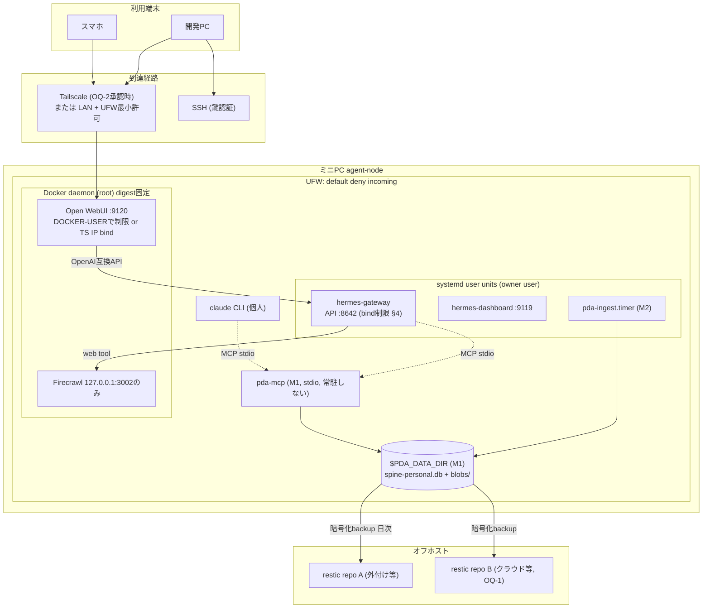

# 07. 配備・運用・復旧

- 最終更新: 2026-07-20
- 上位文書: [README.md](README.md)
- 関連ADR: [ADR-0006](../adr/0006-service-management-single-owner.md)（サービス管理）
- 注意: 本章のミニPC現状は2026-07-20記録のスナップショット（[02](02-current-state-and-gaps.md)）。
  変更作業はすべて将来のマイルストーン作業であり、本設計セッションでは実施していない

## 1. サービス管理の原則（Decision D-6）

**single-owner rule**: 1つのサービスのライフサイクル管理者は1つ。

| サービス種別 | 管理者 | 対象 |
|--------------|--------|------|
| Hermesネイティブプロセス | systemd user unit（linger有効） | hermes-gateway、hermes-dashboard |
| PDAネイティブプロセス | systemd user unit（transitionで `pda` ユーザーのuser unitへ移管） | pda-ingest.timer、（将来）pda-spined |
| コンテナ | Docker daemon（`restart: unless-stopped`）。composeファイルはgit管理、digest固定 | Open WebUI、Firecrawl |

- 現状の破綻したopenwebui user unit（[02 §2.3 G-1/G-2](02-current-state-and-gaps.md)）は **削除** し、
  Docker restart policyへ一本化する（M0）
- ユーザーをdocker groupへ追加しない（root相当権限のため）。compose操作は `sudo docker compose`
- rootless Docker / Podman Quadletへの移行は現時点で不採用。見直し条件は
  [ADR-0006](../adr/0006-service-management-single-owner.md)
- 全compose・unitテンプレートは本リポジトリ `infra/`（M0で新設）にsecretレス形で管理する

## 2. near-term topology（M0〜M2で到達する目標。`$PDA_DATA_DIR`・pda-mcpはM1成果物）

## 3. Secret管理

- **inventory（M0で作成、repoには項目名のみ）**: Hermes API key、Open WebUI連携key、
  Firecrawl `BULL_AUTH_KEY`、Claude Code長期OAuthトークン（**1年失効。更新期日をカレンダー管理**）、
  Codex OAuth、SSH鍵、restic repoパスワード、Tailscale資格（導入時）
- 配置規約: `~/.hermes/.env` 等は権限600を維持。repo・設計文書・ログ・auditのdetailsへ
  値を書かない。pre-commit secret scan（例: 単純パターン検査）をM0で導入
- restic repoパスワードはPDA・backup先のどちらにも置かず本人管理（紙・パスワードマネージャ等の
  オフライン冗長を推奨）
- 将来: secret件数・ローテーション頻度が増えた時点でsops/age等の暗号化管理を再検討（現状は過剰）

## 4. ネットワーク境界（適用順序）

**前提（重要）: UFWはDockerの公開ポートに効かない**。Dockerは自前でPREROUTING/DNATと
FORWARDのDOCKERチェーンを操作するため、`-p 0.0.0.0:9120:8080` のような公開ポート宛のLAN
トラフィックはUFWのINPUTルールを経由しない（周知の「Docker bypasses UFW」問題）。
一方、ホストプロセスが直接listenするポート（Hermes API `:8642`、Dashboard `:9119`）にはUFWが効く。
**効く箇所と効かない箇所が混在する**ため、コンテナ公開ポートはbind制御かDOCKER-USERチェーンで扱う。

1. **待受の最小化（M0）**:
   - **Firecrawl（コンテナ、無認証）**: LAN向け公開を撤去し、compose側で `127.0.0.1:3002:3002` の
     **loopback bind** に限定する（ホストプロセスのHermesはloopback経由で到達できる）。
     「内部networkのみ・公開ポートなし」ではHermesが到達できないため採らない。
     認証なしサービスを `0.0.0.0` に置かない
   - **Open WebUI（コンテナ）:9120**: UFWでは守れない。(a) `127.0.0.1` または **Tailscale IPへの
     bind公開**、または (b) **DOCKER-USERチェーンへのiptablesルール**（ufw-docker等）で
     送信元を管理端末/tailnetに限定する
   - **Hermes API `:8642`（ホストプロセス）**: UFWが効く。Open WebUIコンテナ（dockerブリッジ
     subnet発）と管理経路以外から到達不能にする。UFWで「dockerブリッジsubnetとloopbackのみ許可」
   - **Dashboard `:9119`（ホストプロセス）**: UFWが効く。管理端末IPに限定、Tailscale導入後はtailnetのみ
2. **UFW（M0、ホストプロセス向け）**: default deny incoming。許可は
   **SSH（LAN/tailnet）／`:8642`（dockerブリッジsubnet発）／`:9119`（管理端末IP）／tailscale0**。
   `:9120`と`:3002`はコンテナ側（loopback bind/DOCKER-USER）で扱い、UFW許可リストに依存しない
3. **Tailscale（OQ-2承認時、M0〜M2）**: ポート開放なし方針を維持したまま外出先対応
   （REC§7.1の方針を踏襲）。導入時はACLをdefault allow-allから
   「本人端末→agent-nodeの必要ポートのみ」へ絞る（tailscale.com/kb/1018 確認 2026-07-20）。
   TLS終端が必要なUIはtailnet内HTTPSを検討
4. **非採用**: インターネットへの直接ポート開放、リバースプロキシの公開設置
5. **M0 exitの検証**: 「待受最小化の確認記録」は **別のLAN端末からの実スキャン（nmap等）** で
   到達可能ポートを確認したうえで合格とする（設定を信じるだけにしない）

## 5. バージョン固定・upgrade・rollback

- **pin**: コンテナimageはdigest固定（`ghcr.io/open-webui/open-webui@sha256:...`）。
  Python依存は `uv.lock`。Hermes/Claude Code/CodexのCLIはバージョン記録＋手動更新
- **upgrade手順（共通）**: (1) 直前backup (2) changelog確認 (3) 更新 (4) `pda doctor` (5) 失敗時rollback
- **rollback**: コンテナ=旧digestへ戻す。ネイティブ=旧バージョン再インストール
  （Claude Codeはversions配下に並存）。Spine schema migrationのrollbackは
  [04 §8.3](04-context-spine-and-data-contracts.md)（直前backupからのrestore）
- Hermesの自動更新は無効化し、更新を「意図した操作」に限定する（T-6対策）

## 6. バックアップ・復元・DR

### 6.1 対象分類とmanifest

| 分類 | 対象 | 方法 |
|------|------|------|
| PDA正本 | spine-personal.db、blobs/、audit複製 | SQLiteはOnline Backup API/`VACUUM INTO` でsnapshot後、resticへ |
| Hermes状態 | `~/.hermes/state.db`（同APIでsnapshot）、config（secretレス部分） | restic |
| UI状態 | Open WebUI volume | docker volumeのdump→restic（喪失許容度が高い旨をmanifestに明記） |
| IaC・文書 | 本リポジトリ | git remote＋restic |
| secrets | inventory記載の各項目 | **別系統**（restic対象外。本人管理の暗号化保管） |

manifestにSHA-256・取得時刻・schema version・件数を記録（[04 §8.2](04-context-spine-and-data-contracts.md)）。

### 6.2 RPO / RTO（初期仮説。M0の実測で再調整）

- RPO: **24時間**（日次backup。Spineの重要度が上がったら間隔短縮を検討）。
  ただしこの24hの損失には **connector再取込で回復できないレコード**（手動で承認したclaim、
  approval、直近のauditエントリ）が含まれる。§7の「connector差分再取込で回復」はconnector由来
  eventの話であり、手動生成物は最後のbackup以降の分が失われる。この受容範囲を明記する
- RTO: **半日**（fresh-host復元作業を1人で完了する目標）。**起点は「代替ホスト確保後」**とする。
  ミニPC全損時の機材調達時間はRTOに含めない（予備手段として手元VM／別PCへの一時復元を許容し、
  調達を待たず業務再開できる経路を確保する）。実測は復元drillで更新
- backup先は2系統（ローカル外付け＋オフサイト/クラウド）を推奨。**選定はOQ-1（本人決定）**

### 6.3 復元drill（INV-7の実体）

- **M0 drillの対象（Spine未存在の時点での定義）**: M0時点ではPDA Spineがまだ無い。
  drill対象は **Hermes state.db snapshot・IaC（compose/unit）・Open WebUI volume・secret inventory復元**。
  検証は `sqlite3 ... 'PRAGMA integrity_check'` ＋ Hermes session/message件数の突合。
  **合格をM1のentry conditionとする**。M1でSpineが生じて以降、drill対象にspine-personal.db・blobs・
  audit複製を追加する
- M2以降: 四半期ごとにdrill。年1回はfresh環境（別ディスク/VM）でのフル復元
- fresh-host復元手順（runbook、M0で作成）: OS導入→リポジトリclone→secrets復元→
  restic restore→サービス起動→（M1で追補）`pda doctor` green→（M1で追補）gold set smoke

### 6.4 監視・観測

- `pda doctor --json`: サービスhealth（:8642 /health、:9120、Firecrawl内部、systemd状態、
  DB integrity、disk/RAM、backup鮮度）をread-onlyで判定（M0）
- 構造化ログ: PDAコンポーネントはJSON lines。journald＋logrotate
- アラート: systemd `OnFailure` → 通知（初期はログ＋手動確認、M2でHermes/messaging通知。
  外形監視の要否はOQ-9と合わせて判断）
- 容量監視: disk 80%警告/90%で取込停止（fail-close）。backup鮮度 **>約28h** で警告
  （RPO 24hの破れを丸1日見逃さないよう、48hではなくRPO＋数時間に設定）

## 7. Degraded modes（障害モード別の縮退運転）

| 障害 | 検出 | 縮退時に残る機能 | 復旧 |
|------|------|------------------|------|
| Hermes停止 | doctor / UI不通 | Open WebUI不通。**SSH＋pda-cli検索・claude/codex直接起動は可** | systemd restart。再発時はHermes更新rollback |
| Open WebUI停止 | :9120不通 | Hermes CLI/Dashboardで対話継続 | docker compose再起動 |
| Firecrawl停止 | 内部health | Web取得のみ喪失。他は無影響 | compose再起動。nuq-pg volume化（M0）で消失防止 |
| LLM vendor停止（OpenAI） | adapter/vendorエラー | **Hermes中核推論が停止**（現構成の単一依存）。pda-cli・Claude Code委任は可 | `hermes model` で代替provider切替（要事前設定）。恒久対策はM6のruntime交換能力 |
| LLM vendor停止（Anthropic） | 同上 | Claude Code委任のみ喪失。codex execへfallback | — |
| WAN断 | 疎通監視 | クラウド推論すべて停止。ローカル検索・pack生成・CLI操作は継続 | 復旧待ち。ローカルモデルfallbackはOQ-10 |
| ledger破損 | integrity check / 書込エラー | **全書込停止（fail-close）**。読取は最新snapshotで可 | restore（RPO 24h）→`pda verify replay`→connector差分再取込 |
| index/projection破損 | verify | 検索劣化のみ。正本無影響 | `pda rebuild projections` |
| connector異常 | ingest失敗/dead-letter | 当該source取込のみ停止 | 修正まで無効化。claimは自動変更しない |
| disk pressure | 容量監視 | 取込停止（fail-close）。対話は継続 | retention実行・blob整理・増設判断 |
| backup先障害 | backup失敗通知 | 稼働に影響なし（RPOリスク増大） | 2系統目へ切替。48h以上失敗で作業停止判断 |
| ミニPC全損 | — | なし（PDA停止） | fresh-host復元（RTO半日目標） |

## 8. 容量budgetと分離閾値

### 8.1 現況（Fact: 2026-07-20記録）と初期budget仮説

実効RAM 12GiB・空き約7GiB、SSD空き約396GiB（[02 §2.2](02-current-state-and-gaps.md)）。
以下の内訳は **測定前の仮説** であり、M0で `docker stats` / `systemd-cgtop` により実測して更新する。

| 消費者 | RAM仮説 | 備考 |
|--------|---------|------|
| Firecrawlスタック（7コンテナ級） | 2.5〜3.5GiB | 最大の消費者候補。利用頻度次第で停止運用も選択肢 |
| Open WebUI | 0.5〜1GiB | 内蔵embedding含む |
| Hermes（gateway/dashboard） | 0.5〜1GiB | |
| PDA（ingest/index時ピーク） | 0.5〜1GiB | バッチは夜間直列実行で設計 |
| 余裕 | 2〜4GiB | Claude Code委任実行等の一時負荷用 |

- Spine容量: Hermes履歴・会話系テキストは当面GB未満。ブラウザ/Web本文取込開始後は
  blob中心に増加 → retention（OQ-6）とdisk 80%閾値で制御
- 保守負荷budget: 週数時間（A-05）。自動化はこの範囲で回る設計とし、
  connector追加は運用負荷実績を見て逐次判断（stop/go、[09](09-transition-roadmap.md)）

### 8.2 別ホスト／managed serviceへ分離する閾値

次のいずれかが継続的に成立したら分離を検討する（それまで単一ホスト維持）:

1. RAM使用が平常時80%超、またはswap常用で対話latencyが体感劣化
2. ingest/index処理が夜間バッチ窓（例: 2時間）に収まらない
3. Spine＋blobがdisk 60%を超え、retentionでも増勢が止まらない
4. ローカル推論（embedding/LLM）の必要性が評価で確定し、GPU/RAMが不足
5. 可用性要求が上がり、単一ホスト停止が業務影響を持つようになった

分離時の順序: (1) backup先の強化 → (2) Firecrawl等の周辺サービスを別ホストへ →
(3) Spineとruntime実行の分離。Spineを最後まで手元に残す（INV-1のデータ主権を優先）。
