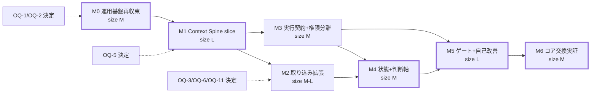

# 09. 移行ロードマップ

- 最終更新: 2026-07-20
- 上位文書: [README.md](README.md)
- 前提: 現在地判定は [02 §5](02-current-state-and-gaps.md)（Phase 3.5相当）。完了粒度・証跡は [08](08-evaluation-and-phase-gates.md)

## 1. 実行モデル

構想のPhase 1〜11は **能力マップ** として保持し、実行単位は依存関係で定義した
マイルストーンM0〜M6で管理する（変更理由: Phaseは到達能力の記述であり、実行順序・
運用品質・評価の3軸が混在していたため。[02 §3 C-1](02-current-state-and-gaps.md)）。
写像は§6に示し、全Phase要求が漏れなくM0〜M6以降に対応することをもって移行影響を吸収する。

calendar dateは定めない。順序は依存関係、規模はrelative size（S/M/L）、
進退はstop/go判定で管理する（brief §4.6）。

## 2. マイルストーン定義

### M0: 運用基盤の再収束（size: M）

これから増えるデータの器を守れる状態を先に作る（INV-7）。取り込み実装より先。

- **Entry**: なし（即着手可能）。ただしOQ-1（backup先）・OQ-2（Tailscale）の本人決定が
  途中で必要
- **Scope**:
  1. 現状のread-only再検証（`pda doctor` の前身スクリプト。2026-07-20スナップショットとの差分確認）
  2. `infra/` 新設: compose・unitテンプレートのsecretレスIaC化、image digest固定
  3. サービス管理一本化（壊れたopenwebui user unit削除、[ADR-0006](../adr/0006-service-management-single-owner.md)）
  4. ネットワーク境界（[07 §4](07-deployment-operations-and-recovery.md)。Firecrawl loopback化、UFW、Tailscale判断反映）
  5. Firecrawl `nuq-postgres` のvolume永続化
  6. backup（restic 2系統）＋restore drill＋reboot drill
  7. data policy / egress policy / approval policyの初版文書化と本人承認（[06](06-security-privacy-and-governance.md)）
  8. secret inventoryとpre-commit secret scan
- **Exit / Evidence**: T-RESTORE-DRILL、T-REBOOT-HEALTH、doctor green、待受最小化の確認記録、
  policy 3点の承認記録
- **Rollback**: 各変更は変更前設定の退避を伴う（unit/composeはgitで前版保持）
- **Stop/go**: restore drillに合格しない限りM1へ進まない

### M1: Context Spine vertical slice（size: L。90日枠は下記「縮小M1」で中規模に絞る）— **最初のvertical slice**

- **Entry**: M0 exit
**縮小M1のScope（90日枠。過積載回避のため意図的に絞る）**:
  1. `pda` Pythonパッケージ骨格（uv / pytest / ruff / mypy、CLI契約テスト）
  2. Spine schema v1 = events / event_edges / blobs / claims系（claims/claim_evidence/
     claim_transitions/claim_edges）/ context_packs系 / audit_log / sources / ingest_runs /
     connector_checkpoints / schema_migrations（[04 §4.9](04-context-spine-and-data-contracts.md)）。
     **task/run/artifact/verdict/approval系はM3でv2 migration**。append-only強制＋audit chainは実装。
     **redaction/retentionはM1では契約定義のみとし、実装はM2 entryへ移す**（M1で扱う個人データは
     少数セッションに限定され削除要求リスクが低いため）。決定論的policy engine（work deny・
     secret除外・write-API secret-scan）の強制実装はM1に含む（R-15/R-21のM1実装分）
  3. conn-hermes（fixtureでTDD→実データはpersonalの少数セッションに限定してdry-run→本人承認後import）
  4. FTS5 trigram検索＋domain/project/as-ofフィルタ（日本語2字語のフォールバック含む。
     blob本文の二層索引は[04 §5.1](04-context-spine-and-data-contracts.md)）
  5. 手動claim登録・承認CLI（`pda claims propose/review`）
  6. Context Pack builder（決定論、budget仮説2,000 tokens）
  7. pda-mcp（read中心: `context_pack` / `evidence_get` / `pack_get`）。
     HermesとミニPC上の個人Claude Codeへ登録（会社アカウント経路は遮断、[05 §5.2](05-orchestration-and-runtime-contracts.md)）
  8. gold set v0 = **GS-RETRIEVAL＋GS-INJECTIONの2種**（GS-TEMPORAL/GS-CONTINUITYの大規模化はM2）。
     `session_search` baseline記録。cross-runtime E2E（T-E2E-CONT）はGS-CONTINUITYの
     最小シナリオ（数問）で実施しsliceの核を実証する
- **Exit / Evidence**: T-INGEST-IDEM、T-PROVENANCE、T-SECRET-EXCLUDE、T-GATE-DENY、
  T-POLICY-WORKDENY、T-CLAIM-LIFECYCLE、T-PACK-CONTRACT/BUDGET、T-ASOF、T-AUDIT-CHAIN、
  T-EXPORT-REBUILD、T-E2E-CONT、GS-RETRIEVAL/GS-INJECTION baseline記録
  （T-REDACTION-PROPAGATIONはredaction実装と共にM2 exitへ）
- **Rollback**: Spineはこの時点で唯一の新規資産。破棄・再importが常に可能（情報源は無傷）
- **Stop/go**: baseline比較（[08 §4](08-evaluation-and-phase-gates.md)）でContext Packが
  `session_search` に対する優位を示せない場合、M2の取込拡大を保留し、
  retrieval/pack設計を再検討する

### M2: 取り込み拡張と運用定着（size: M〜L、connector単位で分割可能）

- **Entry**: M1 exit＋OQ-3（egress許容）・OQ-6（retention既定）の本人決定
- **Scope**: (0) M1で契約定義のみだった **redaction/retentionの実装**（[04 §7](04-context-spine-and-data-contracts.md)）と
  pda-mcp `claim_propose`（M2導入、[05 §5](05-orchestration-and-runtime-contracts.md)）。
  (1) connectorを1つずつ（CONN-SUITE合格を単位に）追加。
  推奨順: 個人Git（低機密） → 個人ChatGPT/Claude exportの小標本 → ブラウザ履歴の明示選択分 →
  Web記事/ブックマーク。並行して: pda-ingest.timer（guard付き定期差分取込）、
  週次audit digest、（未了なら）Tailscale展開。GS-TEMPORAL/GS-CONTINUITYの本格化もここで
- **Exit / Evidence**: 各connectorのCONN-SUITE、T-RESTORE-DRILL再実施（データ増加後）、
  eval回帰（GS-RETRIEVAL拡充込み）
- **Stop/go**: 運用負荷が週次budget（A-05）を超えたらconnector追加を停止し自動化・除外規則を
  先に改善。gold set回帰が悪化したconnectorは無効化

### M3: タスク・実行契約と権限分離（size: M。M2と並行可）

- **Entry**: M1 exit（M2完了は不要）
- **Scope**: Task/Run/Artifact registry（schema v2 migration）、control plane書込API
  （task_create / run_register / run_transition / run_report、[05 §5.1](05-orchestration-and-runtime-contracts.md)）、
  TaskSpec/RunResult、adapter-claude-code / adapter-codex / adapter-hermes、
  handoff/resume/fallback/cancel（lease/liveness/kill含む）、`pda` Unixユーザーと`pda-spined` socket仲介
  （[03 §5.2](03-target-architecture.md)）、audit chainのオフホスト複製自動化。
  （`claim_propose` はM2で導入済み）
- **Exit / Evidence**: T-RUN-CONTRACT、T-HANDOFF、T-RESUME、T-PROTECTED-ASSETS（権限分離後）、
  同一taskの2 runtime実行比較記録
- **Rollback**: 権限分離はユーザー/権限変更のみで、Spineデータ自体は不変。旧構成へ戻せる

### M4: プロジェクト状態と判断軸（size: M）

- **Entry**: Hermes source（M1成果）＋Git source（M2成果）の2つ。会話exportは推奨だが必須でない。加えてM3
- **Scope**: project_state projection、decision/preference/constraint claimのcuration、
  policy claim（判断軸）と承認運用、entity resolution最小版（[04 §10](04-context-spine-and-data-contracts.md)）、
  routing rules v0のpolicy claim化、GS-DECISION / GS-ROUTING作成、
  LLM claim抽出のproposer導入（toolなし・JSON schema固定・model/prompt version記録）
- **Exit / Evidence**: T-PROJECT-RESUME、GS-DECISION baseline、claim審査の運用記録
- **Stop/go**: 判断軸claimの誤適用（本人差し戻し）が高率なら自動適用範囲を縮小

### M5: ゲートと自己改善ループ（size: L）

- **Entry**: M3・M4 exit
- **Scope**: proposer/executor/evaluator分離の強制（sandbox実行・別model評価）、
  認知ゲートの選択適用、self-improvement pipeline（[06 §8](06-security-privacy-and-governance.md)）、
  GS-GATE、canary/rollback運用
- **Exit / Evidence**: T-SELFIMP-PIPELINE、T-PROTECTED-ASSETS（敵対試行含む）、GS-GATE baseline
- **Stop/go**: pipelineの運用コストが改善価値を上回る場合、自己改善は「提案生成＋人間反映」の
  半自動に留める（自動化率は目的ではない）

### M6: コア交換能力の実証（size: M）

- **Entry**: M5 exit（部分的ドリルはM3以降随時可）
- **Scope**: Hermes停止ドリル（degraded pathで業務継続）、代替orchestrator経路
  （pda-cli＋adapter直接、または別harness）で同一gold set・同一task replay、
  vendor outageドリル、model交換時の判断一貫性測定（GS-DECISION再実行）、年次drill定着
- **Exit / Evidence**: T-CORE-SWAP、交換前後のmetric比較記録
- **以降（Phase 11相当）**: コア実装自体の交換・改善を§M5 pipelineの通常対象とする。
  ただしprotected assets・INV群は恒久的に対象外（INV-13）

## 3. 依存関係とcritical path（図10）

- **Critical path**: M0 → M1 → (M3) → M4 → M5 → M6。
  M2はM4の入力（実データ量）を供給するが、connector単位で細分化でき、critical pathを
  塞がない（最低限 Hermes（M1成果）＋Git（M2成果）の2 sourceがM4のentryに必要）
- **直近90日相当のスコープ（A-07: 約60〜80時間）**: この枠で確定的に狙うのは
  **M0全量＋縮小M1のみ**（縮小M1の定義はM1 Scope参照）。M2 connectorとM3は90日枠から
  明示的に外し、縮小M1の評価結果（stop/go）を見てから着手する。過積載を避けるための線引きであり、
  上振れ時のM2前倒しは妨げない

## 4. 最初のvertical slice（再掲・確定）

**M1がvertical sliceそのもの**である: 「Hermesのpersonalセッション数件を、承認付きで
append-only Spineへ冪等に取り込み、出典付きContext PackをHermesとミニPC上の個人Claude Codeが
同一pack_idで取得し、gold set v0でbaselineを記録する」。

- 価値実証: 手動のコンテキスト再説明が、pack取得1回に置き換わる最初の体験
- アーキテクチャを誤固定しない理由: Spine schemaとcontractのみが恒久資産であり、
  retrieval・builder・MCP実装は交換可能なまま小さく作る。graph/vector/providerは含めない
- 仮説文書（HYP §10）の提案と同一方向だが、次を修正して採用:
  (a) M0（backup・境界・サービス管理）をentry conditionとして先行必須化、
  (b) E2E相手を「ミニPC上の個人Claude Code」に限定（会社アカウント経路はOQ-5まで除外）、
  (c) metricは仮説として管理（[08](08-evaluation-and-phase-gates.md)）

## 5. マイルストーン共通のmigration・rollback規約

1. データを増やす変更の前に直前backupを取得する（INV-7）
2. schema変更は前進のみ・migration記録・replay検証（[04 §8.3](04-context-spine-and-data-contracts.md)）
3. サービス構成変更はgit管理されたIaC差分として行い、前版へ戻せる
4. 各マイルストーンのexit判定と証跡は記録として残す（[08 §6](08-evaluation-and-phase-gates.md)）
5. 失敗したマイルストーンは部分成果を隔離し、entry状態へ復帰できることを確認してから再計画する

## 6. Phase 1〜11との写像（要求の漏れ防止）

| 構想Phase | 対応マイルストーン | 補足 |
|-----------|---------------------|------|
| P1 常時稼働基盤 | M0（運用完了化） | 機能PoCは達成済み。M0で運用完了へ |
| P2 Hermes最小PDA | M0〜M1 | cron/承認区別はM2のingest guard・approval policyで実体化 |
| P3 複数runtime統合 | M1（context共有）＋M3（委任契約） | 通信PoCは達成済み |
| P4 情報取り込み | M1（Hermes source）＋M2（拡張） | default deny・最小化を伴う再定義（[02 §3 C-4](02-current-state-and-gaps.md)） |
| P5 PKB/コンテキストグラフ | M1（Spine+FTS+claim+pack）＋M2（評価定着）＋M4（entity） | 「グラフDB導入」ではなく「関係・時間・出典を持つ基盤」として実現 |
| P6 プロジェクト横断管理 | M4 | project_state projection |
| P7 判断軸の形式化 | M4 | policy claim＋GS-DECISION |
| P8 多層認知ゲート | M0〜M3（決定論的層を前倒し）＋M5（認知層） | briefの要求による分割 |
| P9 自己改善 | M5 | |
| P10 コア非依存化 | M1〜M3で構造を先取りし、M6で実証 | |
| P11 完全な自己改変 | M6以降の継続運用 | protected assets・INV-13を恒久除外として維持 |

構想の初期到達点（PLAN §11）はM1完了に、中期到達点（PLAN §12）はM4完了に、
長期到達点（PLAN §13）はM6以降にそれぞれ対応する。
