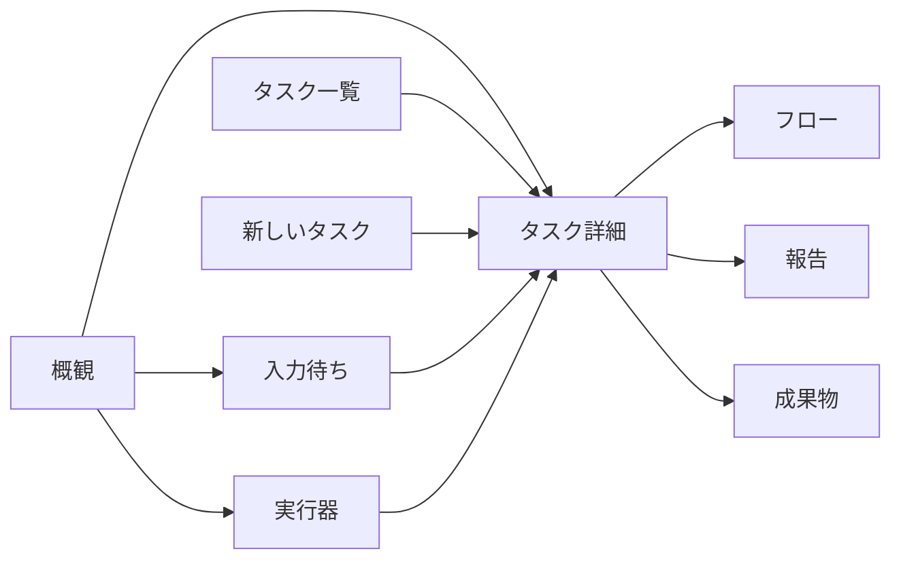

# PDA v0.2 UX 設計

## 1. このシステムは何のためにあるか

PDA は、一人のオーナーが複数の AI に仕事を渡し、今の働き方を見渡し、必要なところだけ介入して、読める報告を受け取る指令所である。ツールの端末を並べることが目的ではない。要件 1 節の「別々の指示・到達経路」「スマートフォンで見えない」「受け渡しが分からない」を解消する。要件 2 節の 2026-09-24、25 の発言と 3.1 のタスクの状態・スレッド・介入・オーナーも実行器、3.2 の 6、7、11、12 を正本とする。

実行器の機械的な終了と、オーナーが記録するタスクの完了を分ける。作業が終われば必ず報告を読む場所に着き、続行・完了・中止を選べる。失敗を即座にオーナーの問題にせず、同じ分岐内で判定器 A、必要ならオブザーバー B を通す。問いは合流後の報告だけが届ける。

## 2. 使う人と場面

利用者はオーナー一人。移動中の片手操作と、PC で長文を読みながらの介入を同じ重要度で扱う。朝は 30 秒の概観、作業中はフロー上の現在位置、入力待ちでは報告を読んで判断、終業時は結果を確認して記録する。スクロールは許すが、本文全体の横スクロールは不要にする。情報を伏せた通知の数字だけで判断させない。

## 3. ユースケースと動線

検証の開始は毎回「見本の操作 → 初期に戻す」。各手順は PC と 390px の双方で共通。スマートフォンでは上端の「画面一覧」から移動する。以下の見本 ID は URL でも使う。

| UC | 場面・目的 | 辿る画面と操作の手順 | 成功の状態 |
|---|---|---|---|
| UC1 | 朝、入力が要る仕事と異常を 30 秒で見渡す | 概観で「自分の番」の件数・内容、動作中タスクの各セル、実行器の生死を見る。API 実装の行を押す。戻って概観を確認する | 待ち理由、通知からの時間、短い報告、実行器の生死と利用状況を確認でき、1 操作で対象を開ける |
| UC2 | 移動中、新しい仕事を依頼する | 上端の「新しいタスク」。長文を入力し「見た目を確認」。任意の作業ディレクトリを指定し「タスクを出す」 | 受付通知とタスク詳細。初期の指示セルと動作中判定器。報告担当はrole設定から決まる |
| UC3 | API 実装の並行作業を知る | タスク api のフローで分岐・合流を見る。「動作中のセルへ」。implement のセルを押し「プロンプト」を開く | 選択セルが URL に入り、詳細に type、実行器、状態、経過時間、事前プロンプトと入力、整形した中間出力、ツール回数が見える |
| UC4 | 意図しない作業を止める | タスク api の「中断」。止まるセルを確認し理由を添えて「実行を中断する」 | 対象セルが中断、理由を持つオーナーセル、続く判定器 A のオブザーバー選択が同じ分岐内に現れる |
| UC5 | API 実装に条件を足す | api のフロー下端「指示を重ねる」に入力して送信 | 次の回にオーナーセルが増え「次の回から有効」。入力待ちなら進行中に戻る |
| UC6 | 依頼の前提を修正する | api のフローで初期のオーナー指示セルを開き「初期の指示を書き換える」。文を直し各選択の説明を読む。「現在の作業を続ける」を保存。もう一度開き「最初からやり直す」で保存。フローと報告を確認する | 前者は以後の判定に指示を反映。後者は動作中のセルを中断し、新しい指示から同じフローに追記する |
| UC7 | 独立した確認を追加する | api の図で判定器セルを選び、「この次にセルを追加」または「並列するセルを追加」を押す。typeと入力を指定して「セルを追加する」 | 選択したセルを基準に接続された図。セルに「オーナーが挿入」 |
| UC8 | 動作中作業に情報を渡す | api の動作中 implement セルを開き「指示を追加」に入力して送信 | 当該セルの詳細にオーナーからの入力、図の当該セルに追加入力の印 |
| UC9 | 再試行の経緯を追い必要なら介入する | retry の失敗 → 判定器 A → 複製を図で確認。失敗セルを開き、対応する別実行器を選んで再試行。environment のオブザーバー B とやり直し、questions の返答待ち終端も開く | オーナー再試行の複製が同じ分岐に増え、元セルの試行履歴に実行器が残る。A/B の選択と作業の担当を区別できる |
| UC10 | 報告を読んで問いに答える | 入力待ちから questions を選ぶ。最後のユーザー入力、失敗セルの最終応答、オブザーバー判断を折りたたみから読む。選択式の「それ以外」にも自由入力でき、全問を入力し「送信」 | 一括送信後に一覧から外れ、タスクが進行中に戻る。フローには1つの返答セルと次の判定器 |
| UC11 | 結果を受け取り記録する | result の「報告」。縦並びの目次で検証結果へ。アイコンでコードを複写。「成果物」で文書・画像を開く。git と外部出力の所在を開く。報告に戻り「完了」 | 3000 字以上の整形報告を読め、報告と別に成果物に到達できる。タスクが完了。続ける場合はフロー下端から指示を重ねられる |
| UC12 | 実行器の席を見渡す | 実行器で codex-personal の 2 タスク計 3 セルを確認。セルを開きフローへ移る。戻り fake-b を起こす。codex-personal の「止める」で対象を確認して停止 | 全担当セルと利用状況が見え、起動で生きている、停止で止まっているに変化。担っていた 3 セルが中断され判定器へ渡る |

## 4. 情報設計

左の一覧は概観、タスク、実行器、role設定、skill登録。入力待ちは上端のinboxアイコンと件数から開く。新しいタスクはいつでも上端から開始する。概観は優先順位、タスク一覧は検索、入力待ちは判断、実行器は担当の偏りと環境を見る場所。タスク詳細内で構造・文書・所在を報告／フロー／成果物に分け、報告を初期表示する。指示の別一覧や監査ログ画面は作らない。

| URL | 対象 |
|---|---|
| `#/overview` | 概観 |
| `#/tasks`、`#/new` | タスク一覧、新しいタスク |
| `#/tasks/:taskId?tab=flow&cell=:cellId` | タスク内の選択セル（返答待ち終端も指定可） |
| `#/tasks/:taskId?tab=report&report=:reportId` | 報告 |
| `#/tasks/:taskId?tab=artifacts` | 成果物 |
| `#/inbox` | 入力待ち一覧。選択するとタスクの報告タブへ移動 |
| `#/roles?role=:roleId`、`#/skills` | role一覧・下部編集パネル、skill登録 |
| `#/executors`、`#/executors/:executorId` | 実行器。担当セルはタスクのフローに直接移動 |

## 5. 画面ごとの設計

| 画面 | 目的と視点の誘導（左から順） | 要素・操作・状態の差 |
|---|---|---|
| 共通外枠 | 製品名・新規依頼 → 入力待ち件数 → 現在位置 | Cloudscape の上端、左一覧、パンくず、上部受付通知。モバイルで左一覧を収納。見本の操作は本文下端の折り畳み |
| 概観 | 自分の番 → 動作中タスク → 実行器 | 各報告の理由と短い要点、各動作セルを 1 行ずつ。作業時間は行の右上に表示し、長時間の判定や注記を付けない。空なら新規依頼、読み込みならスピナー、接続不可なら再読み込み |
| タスク一覧 | 状態ごとの件数 → 検索と並べ替え → タスクの現在 | PC は 5 列の表（タスク、状態、実行時間、待機時間、最終更新）。状態には動きまたは待ち理由を統合し、最終更新は日付と時刻の二段。10 件ずつページ送り。モバイルは同じ情報のカード。0 件は解除経路 |
| タスク詳細 | 指示・状態 → 現在の一文 → 報告 | 操作ボタンは見出し右上。報告を初期表示し、未作成なら途中の要約。フローは過去のセルを含めて一続きに表示。過去の報告は報告の選択で参照する |
| 入力待ち | タスク名・待ち理由 → 通知からの時間 → 短い報告 | PC・モバイル共に一覧のみ。カードを押すとタスクの報告タブへ移動 |
| 実行器 | 生死・担当数・利用状況 → 担当セルの今の作業 | 各実行器の全担当セルを列挙。担当セルはタスクのフローを開き、詳細パネルを展開。利用状況スクリプトを個別に設定し、応答JSONを表示 |
| 新しいタスク | 指示 → 任意の作業場所 → 送信 | 長文入力と整形プレビュー。空の指示は送れない |
| role設定 | role一覧 → 下部パネルで編集 → 保存 | 実行器・モデル・プロンプトを個別設定。登録済みskillはポップアップで選択。生成済みセルの設定は保持 |
| skill登録 | 登録済み一覧 → 登録・編集 | 名前・参照先・説明を保存し、roleから選択 |

セル詳細はPC・スマートフォン共にグラバーのない下部パネル。見出しのリンクで対象セルへ移動する。状態、出所、経過、この試行に与えた入力、公開出力、プロンプト、ツール回数、試行履歴を表示。完了・合流済みセルへの追加指示では「後続のセルの成果を破棄し、このセルからやり直しますか？」を確認する。オーナー指示セルは指示内容・出所・適用範囲と、初期指示の編集を表示する。報告セルから本文・返答へ、返答待ち終端からオブザーバー判断へ進める。中断確認には対象セル全件と任意の理由、書き換え対話には影響の説明を出す。

報告は Markdown/HTML を無害化して整形し、縦並びの目次、コード複写アイコン、著者と時刻を置く。問いは報告本文の下で回答し、全回答を一括送信して再開する。選択式にも「それ以外」の自由入力欄を置く。報告担当が判断に必要と選んだ成果物を「報告のための成果物」として問いより上に表示する。ファイルは実ファイル名のリンクと作業ディレクトリからの相対パスのみを表示し、文書・画像をプレビューする。外部URLはリンクにする。複数報告は戻る・進むと選択欄で移動する。

## 6. フロー図の表現規則

React Flow のキャンバスと ELK layered により自動配置する。PC は左から右、767px 以下は上から下。回ごとの判定器 → 分岐（各セルの鎖）→ 合流を実線・矢印で描く。返答待ちも合流へ結ぶが、分岐終端として破線の楕円にし、セル数には数えない。合流は小さな横線の結節点。回の冒頭のオーナーセルも必ず線で判定器に接続する。

| 種類 | 箱の形・印 | 箱の内容 |
|---|---|---|
| オーナー | 角丸・人物の SVG 印 | 指示／返答／書き換え、指示本文の抜粋、適用範囲 |
| 判定器 | 角を落とした六角形・菱形印 | judge、jev、状態、経過、次の仕事または分岐 A の選択 |
| 作業 | 長方形・工具印 | 実 type、実行器、状態、経過、挿入／再試行／追加入力の印 |
| オブザーバー | 二重枠・目の SVG 印 | observe、担当、状態、経過、分岐 B の選択（指示だけを出す） |
| 報告 | 書類形・文書印 | report、指定担当、状態、経過、問いありの印 |
| 返答待ち | 破線の楕円・停止印 | 分岐の終端、返答待ち。押すと判断の要点 |

状態色は 7 節と共通。動作中のみ枠に緩い脈動（動きを減らす設定なら停止）。判定器 A の再試行は元セルを複製、オーナー再試行は別の印。失敗 → A → 複製 → A → B → 作業のやり直し／返答待ちが同じ枝の鎖に残る。

拡大・縮小・全体表示・動作中のセルへ、PC の縮小図、凡例、終了回の折り畳みと再展開を用意する。線の経路も ELK の直交配置を使い、別のセルの箱を横切らないようにする。将来の回を表す仮のセルを置かない。セルの詳細から、その次または並列にセルを追加する。合流は実際に合流した時点で図に現れる。8 回 30 セルの見本は終了 7 回を初期に畳み、現在の回を読める縮尺にする。全体表示は全ノード、現在移動は動作セルまたは最新の回を対象にする。個々のセルは Tab/Enter でも開ける。

## 7. 見た目の規則

白（#ffffff）と明るい灰色（#f4f5f7）の面、濃い本文（#161d26）、細い灰色の線。主操作の青以外は状態にだけ色を使う。動作中／進行中は青 #0972d3、終わった／完了／生きているは緑 #037f0c、失敗／停止は赤 #b42318、通常の入力待ち／返答待ちは待機表示、中断による入力待ちと中断セルは黄色三角、待機／不明は灰 #5f6b7a、中断／中止は灰 #414d5c。語と SVG の印を必ず添える。

本文・ボタン・表は 14px、見出しは 18〜28px、補助は 12〜14px。端末の日本語フォントを使い、外部フォントを要求しない。8px 刻みの間隔、カード内 16〜20px、ページ間隔 24px。装飾写真・絵文字・暗色配色は置かない。本文は選択可能。フォーカス輪郭と押せる領域を維持する。

## 8. スマートフォンでの振る舞い

390px を最小検証幅とする。上端に PDA、新しいタスク、入力待ち件数、画面一覧。カードや操作は折り返し、表はカードへ変更。フローだけは独立したキャンバスでパン・ズームを許す。下からのセル詳細は高さを持つスクロール領域で、閉じると図へ戻る。長いコード・表は文書の区画内でスクロールし、URL・パス・日本語長文は折り返す。入力待ちは一覧からタスクの報告タブへ移動する。

## 9. 指示に無かった判断

- 見本状態はブラウザ内で保存し、再読み込みと URL 共有時の対象選択を確認できるようにする。「初期に戻す」で依頼と変更を復元する。role・skill・実行器の利用状況設定も保持する。
- 宣言にない observe/report は指定された見本用 type とし、summarize を支える実行器の模擬能力として扱う。宣言自体を変更しない。API に新しく必要な契約として data-needs に明記する。
- 見本のgitは所在プレビューを開く。外部URLは別タブのリンク。画像は同梱SVG、文書は見本内容を表示する。
- 「1 歩進める」は現在開いている進行中タスクを優先し、他画面では先頭の進行中タスクを対象にする。判定・失敗・再試行・観察・やり直し・合流・報告を段階的に進め、オーナーが記録する完了／中止は変えない。
- 待機時間は待ち状態になってからの時間。実行時間は最終指示の受理からページを開いた時点、待機中なら待ち状態になるまでの時間。利用状況の値・単位・alertはスクリプト応答に従い、画面側では閾値を判定しない。
- 全質問を一括送信して再開する。送信前の入力は下書きであり、個別に回答済みにはしない。全回答を1つの返答セルに保存する。
- すでに自動再試行が動作中元セルをオーナーが再試行した場合は、同じ分岐の中で元セルから別の複製へ線を分け、両方を合流に接続する。動作中の再試行を黙って止めないため。試行履歴も両方を保持する。
- 実行を止める操作と、タスクの中止記録を分ける。完了記録時も動作中セルがあれば影響を示して終了させ、完了後に模擬時間がタスクを再開しない。

技術参照: [Cloudscape App layout](https://cloudscape.design/components/app-layout/)（外枠・詳細枠）、[React Flow ELK example](https://reactflow.dev/examples/layout/elkjs)（層状配置）。
