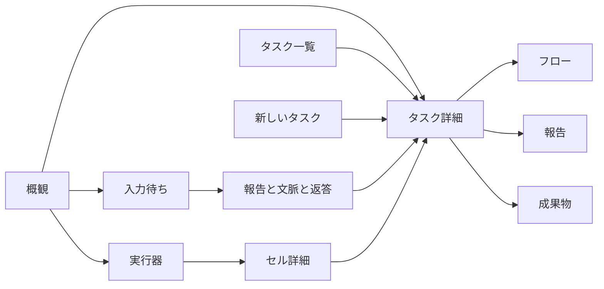

# PDA v0.2 UX 設計

## 1. このシステムは何のためにあるか

PDA は、一人のオーナーが複数の AI に仕事を渡し、今の働き方を見渡し、必要なところだけ介入して、読める報告を受け取る指令所である。ツールの端末を並べることが目的ではない。要件 1 節の「別々の指示・到達経路」「スマートフォンで見えない」「受け渡しが分からない」を解消する。要件 2 節の 2026-09-24、25 の発言と 3.1 のタスクの状態・スレッド・介入・オーナーも実行器、3.2 の 6、7、11、12 を正本とする。

実行器の機械的な終了と、オーナーが記録するタスクの完了を分ける。作業が終われば必ず報告を読む場所に着き、続行・完了・中止を選べる。失敗を即座にオーナーの問題にせず、同じ分岐内で判定器 A、必要ならオブザーバー B を通す。問いは合流後の報告だけが届ける。

## 2. 使う人と場面

利用者はオーナー一人。移動中の片手操作と、PC で長文を読みながらの介入を同じ重要度で扱う。朝は 30 秒の概観、作業中はフロー上の現在位置、入力待ちでは報告を読んで判断、終業時は結果を確認して記録する。スクロールは許すが、本文全体の横スクロールは不要にする。情報を伏せた通知の数字だけで判断させない。

## 3. ユースケースと動線

検証の開始は毎回「見本の操作 → 初期に戻す」。各手順は PC と 390px の双方で共通。スマートフォンでは上端の「画面一覧」から移動する。以下の見本 ID は URL でも使う。

| UC | 場面・目的 | 辿る画面と操作の手順 | 成功の状態 |
|---|---|---|---|
| UC1 | 朝、入力が要る仕事と異常を 30 秒で見渡す | 概観で「自分の番」の件数・内容、動いているタスクの各セル、実行器の生死を見る。API 実装の行を押す。戻って概観を確認する | 問い・結果・規則停止の違い、再試行・長時間・停止を識別でき、1 操作で対象を開ける |
| UC2 | 移動中、新しい仕事を依頼する | 上端の「新しいタスク」。長文を入力し「見た目を確認」。作業ディレクトリと報告実行器を選び「タスクを出す」 | 受付通知とタスク詳細。初期の指示セルと動いている判定器。次の作成で前回の報告実行器を保持 |
| UC3 | API 実装の並行作業を知る | タスク api のフローで分岐・合流を見る。「いま動いているところへ」。implement のセルを押し「プロンプト」を開く | 選択セルが URL に入り、詳細に type、実行器、状態、経過時間、事前プロンプトと入力、整形した中間出力、ツール回数が見える |
| UC4 | 意図しない作業を止める | タスク api の「中断」。止まるセルを確認し理由を添えて「実行を中断する」 | 対象セルが中断、理由を持つオーナーセル、続く判定器 A のオブザーバー選択が同じ分岐内に現れる |
| UC5 | API 実装に条件を足す | api のフロー下端「指示を重ねる」に入力して送信 | 次の回にオーナーセルが増え「次の回から有効」。入力待ちなら進行中に戻る |
| UC6 | 依頼の前提を修正する | api の「初期の指示を書き換える」。文を直し各選択の説明を読む。「以後の回から有効」を保存。もう一度開き「最初からやり直す」で保存。実行を切り替える | 前者は次の回の書き換えセル。後者は同じタスクに実行 2、実行 1 は中断のまま参照できる |
| UC7 | 独立した確認を追加する | api の図の「次の回にセルを挿し込む」。verify.lint と入力を指定して「セルを挿し込む」 | 次の回の判定器から新しい分岐を経て合流に結ぶ図。セルに「オーナーが挿入」 |
| UC8 | 動いている作業に情報を渡す | api の動いている implement セルを開き「追加入力」を送信 | 当該セルの詳細にオーナーからの入力、図の当該セルに追加入力の印 |
| UC9 | 再試行の経緯を追い必要なら介入する | retry の失敗 → 判定器 A → 複製を図で確認。失敗セルを開き、対応する別実行器を選んで再試行。environment のオブザーバー B とやり直し、questions の返答待ち終端も開く | オーナー再試行の複製が同じ分岐に増え、元セルの試行履歴に実行器が残る。A/B の選択と作業の担当を区別できる |
| UC10 | 報告を読んで問いに答える | 入力待ちから questions を選ぶ。報告、初期指示、小さな分岐図、オブザーバー判断、成果物を読む。承認・選択・自由文の 3 問を返答する。「次の報告へ」 | 全回答後に一覧から外れ、タスクが進行中に戻る。フローには返答セルと次の判定器。次の報告が開く |
| UC11 | 結果を受け取り記録する | result の「報告」。目次で検証結果へ。コードを複写。「成果物」で文書・画像を開き持ち出す。git と外部出力の所在を開く。報告に戻り「完了として記録」 | 3000 字以上の整形報告を読め、報告と別に成果物に到達できる。タスクが完了。続ける場合はフロー下端から指示を重ねられる |
| UC12 | 実行器の席を見渡す | 実行器で codex-personal の 2 タスク計 3 セルを確認。セルを開きフローへ移る。戻り fake-b を起こす。codex-personal の「止める」で対象を確認して停止 | 全担当セルと受け渡しが見え、起動で生きている、停止で止まっているに変化。担っていた 3 セルが中断され判定器へ渡る |

## 4. 情報設計

左の一覧は概観、タスク、入力待ち（件数）、実行器。新しいタスクはいつでも上端から開始する。概観は優先順位、タスク一覧は検索、入力待ちは判断、実行器は担当の偏りと環境を見る場所。タスク詳細内で構造・文書・所在をフロー／報告／成果物に分ける。指示の別一覧や監査ログ画面は作らない。

| URL | 対象 |
|---|---|
| `#/overview` | 概観 |
| `#/tasks`、`#/new` | タスク一覧、新しいタスク |
| `#/tasks/:taskId?run=:runId&tab=flow&cell=:cellId` | 特定の実行と選択セル（返答待ち終端も指定可） |
| `#/tasks/:taskId?run=:runId&tab=report&report=:reportId` | 報告 |
| `#/tasks/:taskId?tab=artifacts` | 成果物 |
| `#/inbox`、`#/inbox/:taskId` | 入力待ち一覧と報告・返答・文脈 |
| `#/executors`、`#/executors/:executorId?task=:taskId&cell=:cellId` | 実行器と選択セル |

## 5. 画面ごとの設計

| 画面 | 目的と視点の誘導（左から順） | 要素・操作・状態の差 |
|---|---|---|
| 共通外枠 | 製品名・新規依頼 → 入力待ち件数 → 現在位置 | Cloudscape の上端、左一覧、パンくず、上部受付通知。モバイルで左一覧を収納。見本の操作は本文下端の折り畳み |
| 概観 | 自分の番 → 動いているタスク → 実行器 | 各報告の理由と短い要点、各動作セルを 1 行ずつ。再試行・立て直し・長時間、停止は語と状態色を添える。空なら新規依頼、読み込みならスピナー、接続不可なら再読み込み |
| タスク一覧 | 状態ごとの件数 → 検索と並べ替え → タスクの現在 | PC は 7 列の表（タスク、状態、いまの動き、入力待ち理由、関わる実行器、経過、更新）。10 件ずつページ送り。モバイルは同じ情報のカード。0 件は解除経路 |
| タスク詳細 | 指示・状態 → 現在の一文 → フローの現在位置 → 必要なセル詳細 | 指示全文を展開可。実行器・作業場所・経過、実行切替、8 介入の入口。報告なしは途中の要約。過去の実行は状態・報告を維持 |
| 入力待ち | 報告の理由 → 報告本文と問い → 文脈 → 返答 | PC は左の一覧と右の詳細。モバイルは一覧と詳細の別 URL。問い・結果・規則停止をまとめる。返答後は次の報告への操作。文脈は折り畳まず表示 |
| 実行器 | 生死・担当数 → 担当セルの今の作業 → 受け渡し | 6 実行器を区画化。全担当セルを列挙し、元セルと待っているセルを表示。空席は控えめ、停止・不明は強調。生死と動作の絞り込み。起動・停止、セル詳細からタスクへ |
| 新しいタスク | 指示 → 任意の作業場所 → 報告実行器 → 送信 | 長文入力と整形プレビュー。空の指示は送れない。報告担当を端末に記憶。回数上限は置かない |

セル詳細は Cloudscape SplitPanel を使用。PC では右、スマートフォンでは下。状態、出所、経過、中間出力、畳んだプロンプト、ツール回数表、試行履歴の順。追加入力と再試行は対象状態でだけ表示。報告セルから本文・返答へ、返答待ち終端からオブザーバー判断へ進める。中断確認には対象セル全件と任意の理由、書き換え対話には影響の説明を出す。

報告は Markdown/HTML を無害化して整形し、見出し目次、コード複写、著者と時刻を置く。問いは報告と同じ文書の下で回答し、未回答がある間はタスクを再開しない。成果物はファイル／git／外部出力で区分し、文書・画像のプレビューと持ち出しを提供する。

## 6. フロー図の表現規則

React Flow のキャンバスと ELK layered により自動配置する。PC は左から右、767px 以下は上から下。回ごとの判定器 → 分岐（各セルの鎖）→ 合流を実線・矢印で描く。返答待ちも合流へ結ぶが、分岐終端として破線の楕円にし、セル数には数えない。合流は小さな横線の結節点。回の冒頭のオーナーセルも必ず線で判定器に接続する。

| 種類 | 箱の形・印 | 箱の内容 |
|---|---|---|
| オーナー | 角丸・人物の SVG 印 | 指示／返答／書き換え、オーナー、状態、経過、次の回から有効 |
| 判定器 | 角を落とした六角形・菱形印 | judge、jev、状態、経過、次の仕事または分岐 A の選択 |
| 作業 | 長方形・工具印 | 実 type、実行器、状態、経過、挿入／再試行／追加入力の印 |
| オブザーバー | 二重枠・目の SVG 印 | observe、担当、状態、経過、分岐 B の選択（指示だけを出す） |
| 報告 | 書類形・文書印 | report、指定担当、状態、経過、問いありの印 |
| 返答待ち | 破線の楕円・停止印 | 分岐の終端、返答待ち。押すと判断の要点 |

状態色は 7 節と共通。動作中のみ枠に緩い脈動（動きを減らす設定なら停止）。判定器 A の再試行は元セルを複製、オーナー再試行は別の印。失敗 → A → 複製 → A → B → 作業のやり直し／返答待ちが同じ枝の鎖に残る。

拡大・縮小・全体表示・いま動いているところへ、PC の縮小図、凡例、終了回の折り畳みと再展開を用意する。8 回 30 セルの見本は終了 7 回を初期に畳み、現在の回を読める縮尺にする。全体表示は全ノード、現在移動は動作セルまたは最新の回を対象にする。個々のセルは Tab/Enter でも開ける。

## 7. 見た目の規則

白（#ffffff）と明るい灰色（#f4f5f7）の面、濃い本文（#161d26）、細い灰色の線。主操作の青以外は状態にだけ色を使う。動いている／進行中は青 #0972d3、終わった／完了／生きているは緑 #037f0c、失敗／停止は赤 #b42318、入力待ち／返答待ちは琥珀 #8d5700、待機／不明は灰 #5f6b7a、中断／中止は灰 #414d5c。語と SVG の印を必ず添える。

本文・ボタン・表は 14px、見出しは 18〜28px、補助は 12〜14px。端末の日本語フォントを使い、外部フォントを要求しない。8px 刻みの間隔、カード内 16〜20px、ページ間隔 24px。装飾写真・絵文字・暗色配色は置かない。本文は選択可能。フォーカス輪郭と押せる領域を維持する。

## 8. スマートフォンでの振る舞い

390px を最小検証幅とする。上端に PDA、新しいタスク、入力待ち件数、画面一覧。カードや操作は折り返し、表はカードへ変更。フローだけは独立したキャンバスでパン・ズームを許す。下からのセル詳細は高さを持つスクロール領域で、閉じると図へ戻る。長いコード・表は文書の区画内でスクロールし、URL・パス・日本語長文は折り返す。入力待ち詳細は報告・問い・文脈を同じページに表示し、必要な文脈へページ内リンクも置く。

## 9. 指示に無かった判断

- 見本状態はブラウザ内で保存し、再読み込みと URL 共有時の対象選択を確認できるようにする。「初期に戻す」で依頼と変更を復元する。報告担当の前回選択は別に保持する。
- 宣言にない observe/report は指定された見本用 type とし、summarize を支える実行器の模擬能力として扱う。宣言自体を変更しない。API に新しく必要な契約として data-needs に明記する。
- 見本の git・公開先は外部通信しないローカルの所在プレビューを開き、所在をテキストで持ち出せる。実環境へ操作を送らないため。画像は同梱 SVG、文書は見本内容を Blob にして持ち出す。
- 「1 歩進める」は現在開いている進行中タスクを優先し、他画面では先頭の進行中タスクを対象にする。判定・失敗・再試行・観察・やり直し・合流・報告を段階的に進め、オーナーが記録する完了／中止は変えない。
- 経過 30 分以上の動作セルに「長時間」を添える。これは見渡すための注記で、実行を止める規則ではない。
- 全質問を回答してから次の回へ進める。途中回答は保存済み表示を残す。返答セルには全回答をまとめるので、問いの取りこぼしがない。
- 実行を止める操作と、タスクの中止記録を分ける。完了記録時も動いているセルがあれば影響を示して終了させ、完了後に模擬時間がタスクを再開しない。

技術参照: [Cloudscape App layout](https://cloudscape.design/components/app-layout/)（外枠・詳細枠）、[React Flow ELK example](https://reactflow.dev/examples/layout/elkjs)（層状配置）。
